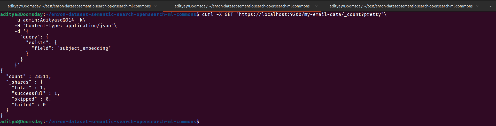
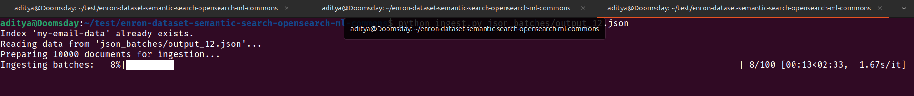
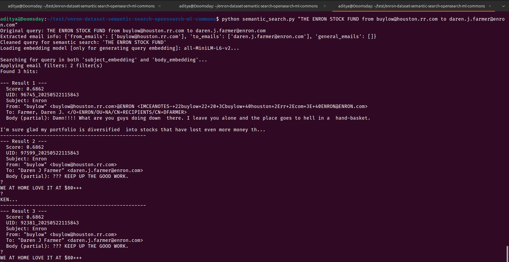
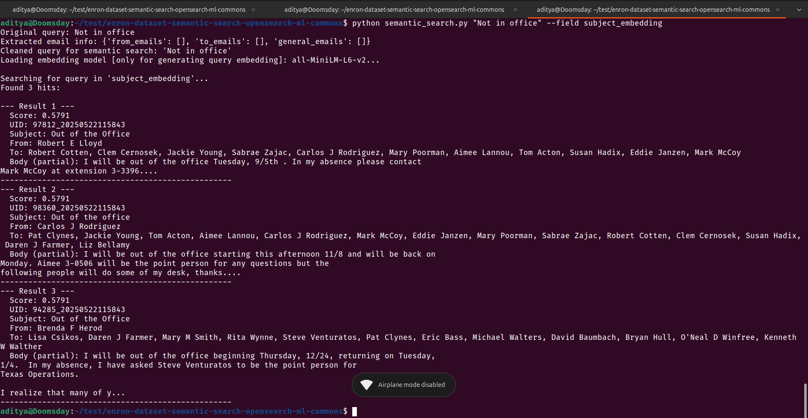
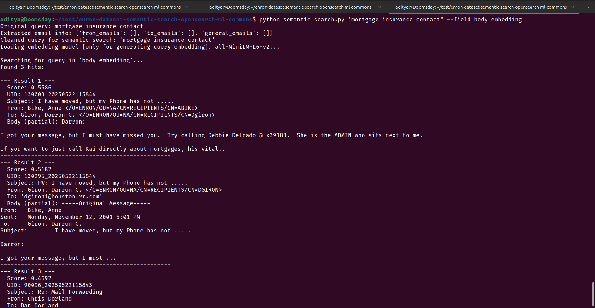
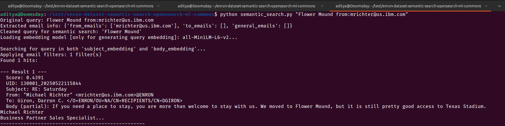
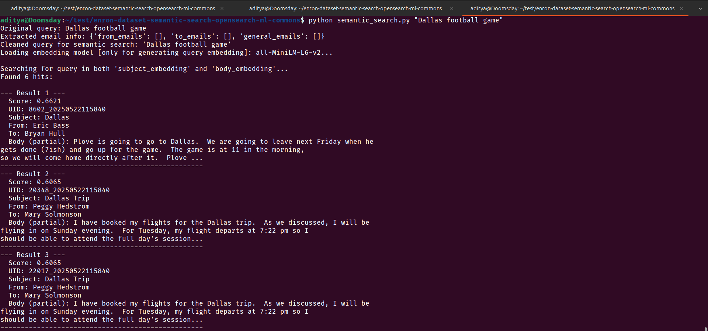
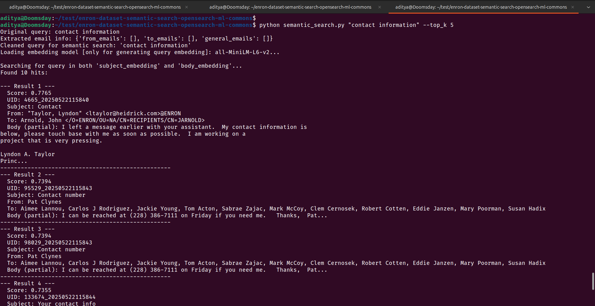

    

Semantic Search Results
=======================

This document summarizes semantic search operations on the Enron email dataset using OpenSearch ML Commons.

1\. Operations Overview
-----------------------

### 1.1. Total Embedding Count

Command:

```
curl -X GET "https://localhost:9200/my-email-data/_count?pretty" -u admin:Adityasd@314 -k -H "Content-Type: application/json" -d '{"query": {"exists": {"field": "subject_embedding"}}}'
```

Output: 

### 1.2. Ingest Command

Command:

```
python ingest.py <path_to_your_json_data_file.json> --batch_size <desired_batch_size>
```

Output: 

2\. Semantic Search Examples
----------------------------

### 2.1. Query: "THE ENRON STOCK FUND from buylow@houston.rr.com to daren.j.farmer@enron.com"

Command:

```
python semantic_search.py "THE ENRON STOCK FUND from buylow@houston.rr.com to daren.j.farmer@enron.com"
```

Output: 

### 2.2. Query: "Not in office" (Subject Embedding)

Command:

```
python semantic_search.py "Not in office" --field subject_embedding
```

Output: 

### 2.3. Query: "mortgage insurance contact" (Body Embedding)

Command:

```
python semantic_search.py "mortgage insurance contact" --field body_embedding
```

Output: 

### 2.4. Query: "Flower Mound from:mrichter@us.ibm.com"

Command:

```
python semantic_search.py "Flower Mound from:mrichter@us.ibm.com"
```

Output: 

### 2.5. Query: "Dallas football game"

Command:

```
python semantic_search.py "Dallas football game"
```

Output: 

### 2.6. Query: "contact information" (`--top_k 5`)

Command:

```
python semantic_search.py "contact information" --top_k 5
```

Output: 
